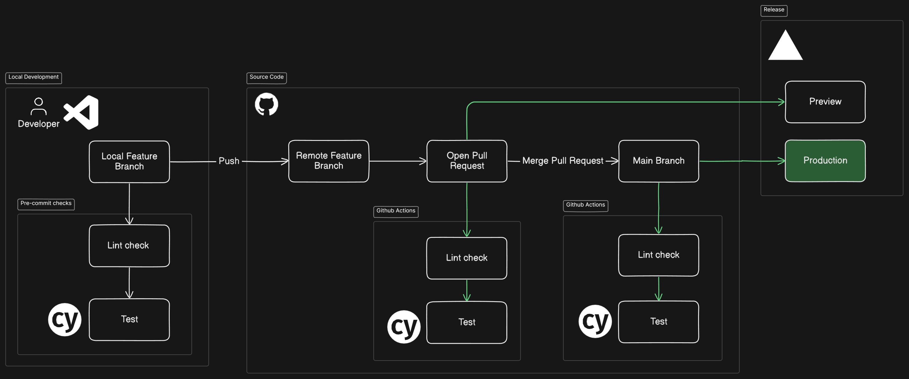

# 🌐 Network Info Tracker

A responsive, client-side web application that displays real-time network information such as public/private IP addresses, ISP, geolocation, DNS details, connection speed, and privacy indicators. Built using vanilla JavaScript, HTML, and CSS — deployed on [Vercel](https://vercel.com).

---

## 🛳️ CI/CD Pipeline



---

## 🚀 Features

- Detects public IPv4/IPv6, private IPs
- Shows ISP, ASN, city, country, and coordinates
- Identifies WebRTC leaks and possible VPN usage
- Performs ping, download, and upload speed tests
- Displays real-time connection type and status
- History tracking of network changes using `localStorage`
- Responsive and mobile-friendly UI

---

## 🧪 Testing & CI/CD Pipeline

This project uses:

- ✅ **Cypress** for end-to-end testing
- ✅ **ESLint** and **Prettier** for code quality
- ✅ **GitHub Actions** to run lint and tests on:
  - Feature branch pushes (pull requests)
  - Main branch commits (production)
- ✅ **Vercel** for preview and production deployment

## 🛠️ Getting Started

### 📦 Install dependencies

```bash
npm install
```

### 🔍 Run Cypress Tests

```bash
npm run test
```

### 🌐 Start local server (Lite Server)

```bash
npm start
```

---

## 🧠 Tech Stack

- Vanilla JS, HTML, CSS
- Vercel (for deployment)
- Cypress (testing)
- ESLint + Prettier (linting and formatting)
- GitHub Actions (CI/CD)
- Lite Server (local dev)

---

## 👤 Author

**Justin Looi**  
